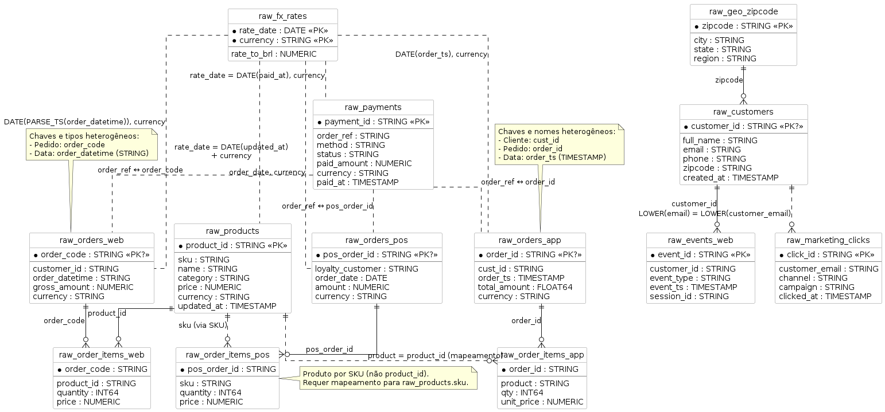
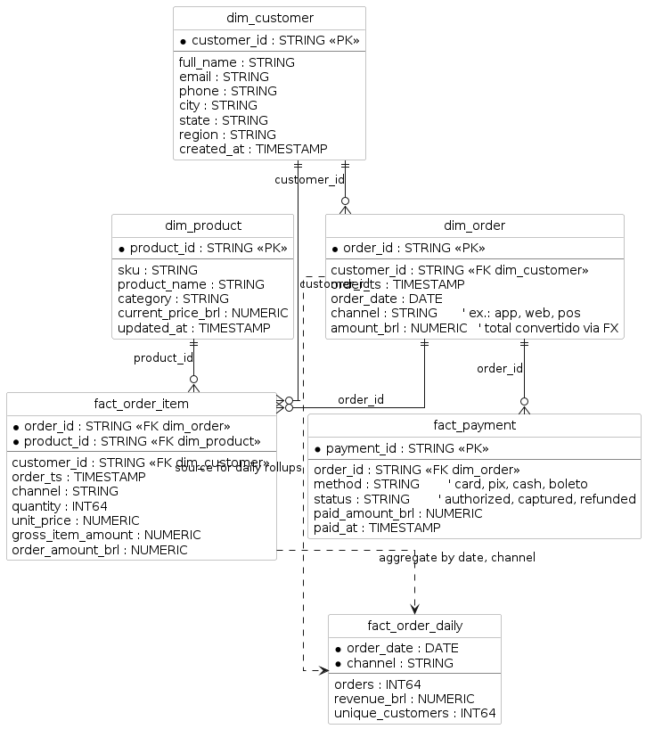

# Mackenzie-dataprep-2025-2

Projeto da disciplina de Data Preparation / MBA Engenharia de Dados

# Data Transformation

## Database

```sh
docker run -d \
    --name postgres \
    --rm \
    -e POSTGRES_USER=new_user \
    -e POSTGRES_PASSWORD=my_pwd \
    -p 5432:5432 \
    postgres
```

## Python

- Instalar dependencias

```sh
make install
. venv/bin/activate
```

## dbt 

- https://www.getdbt.com/

- dbname (default database that dbt will build objects in): postgres
- schema (default schema that dbt will build objects in): public

```sh
export DBT_PROFILE_DIR=$(pwd)/profiles
dbt init study_dbt --profiles-dir=$DBT_PROFILE_DIR
export DBT_PROJECT_DIR=$(pwd)/study_dbt
dbt debug --profiles-dir=$DBT_PROFILE_DIR
dbt run --profiles-dir=$DBT_PROFILE_DIR
dbt seed --profiles-dir=$DBT_PROFILE_DIR
dbt compile --profiles-dir=$DBT_PROFILE_DIR

dbt docs generate --profiles-dir=$DBT_PROFILE_DIR
dbt docs serve --profiles-dir=$DBT_PROFILE_DIR
```

# Diagramas



--- 




# 📊 Tarefas de Data Transformation

| **Etapa** | **Descrição** | **Exemplo prático (PostgreSQL SQL)** |
|-----------|---------------|---------------------------------------|
| **Data Discovery & Interpretation** | Explorar fontes e entender estrutura atual. | `SELECT * FROM raw_orders LIMIT 10;` |
| **Data Cleansing** | Corrigir erros, tratar nulos, remover duplicados. | `SELECT DISTINCT user_id FROM raw_users WHERE email IS NOT NULL;` |
| **Data Normalization** | Padronizar formatos, escalas e unidades. | `CAST(price AS NUMERIC)` / `LOWER(email)` |
| **Data Aggregation** | Resumir dados em métricas. | `SELECT customer_id, SUM(amount) FROM silver_orders GROUP BY customer_id;` |
| **Data Filtering** | Selecionar subconjuntos de interesse. | `SELECT * FROM silver_orders WHERE order_date >= '2025-01-01';` |
| **Data Manipulation** | Criar colunas derivadas. | `AGE(NOW(), signup_date) AS customer_age` |
| **Data Mapping** | Relacionar colunas de origem/destino. | `raw_orders.customer_id → silver_orders.customer_id` |
| **Data Enrichment** | Adicionar contexto externo. | `JOIN geo_data ON customers.zipcode = geo_data.zipcode` |
| **Data Integration/Combining** | Unir diferentes tabelas/fontes. | `JOIN orders o ON o.customer_id = c.customer_id` |
| **Data Validation** | Validar integridade e consistência. | `CHECK (amount > 0)` ou testes dbt (`unique`, `not_null`) |


# 📊  Conexão com dbt

- Discovery → feito antes do modelo, explorando dados seeds ou staging.
- Cleansing, Normalization, Filtering, Manipulation → normalmente no layer Silver (staging models em dbt).
- Aggregation, Integration, Enrichment → aplicados em layer Gold (mart models em dbt).
- Mapping → documentado em schema.yml e refletido em ref() entre modelos.
- Validation → implementado com dbt tests (unique, not_null, accepted_values, testes customizados).

# 📋 Template de Transformation Mapping

Este template deve ser preenchido pelos alunos ao mapear a transformação de **Bronze (RAW)** → **Silver** → **Gold**.

| **Fonte (Bronze/RAW)** | **Coluna Fonte** | **Transformação Aplicada** | **Destino (Silver/Gold)** | **Coluna Destino** | **Observações** |
|-------------------------|------------------|----------------------------|---------------------------|--------------------|-----------------|
| raw_orders_app          | order_id         | Copiar direto              | stg_orders                | order_id           | Identificador único do pedido |
| raw_orders_web          | order_datetime   | `PARSE_TIMESTAMP(...)`     | stg_orders                | order_ts           | Normalização de data |
| raw_orders_pos          | amount, currency | `amount * fx.rate_to_brl`  | stg_orders                | amount_brl         | Conversão de moeda |
| raw_customers           | email            | `LOWER(email)`             | stg_customers             | email              | Padronização de e-mail |
| raw_customers           | zipcode          | `JOIN raw_geo_zipcode`     | stg_customers             | city, state, region| Enriquecimento com geolocalização |
| raw_order_items_pos     | sku              | `JOIN raw_products.sku`    | stg_order_items           | product_id         | Mapeamento produto |
| raw_payments            | order_ref        | Relacionar a order_id      | stg_payments              | order_id           | Mapping entre canais |
| stg_orders              | order_ts         | `DATE(order_ts)`           | fact_order_daily          | order_date         | Derivação para métricas diárias |
| stg_orders              | amount_brl       | `WHERE amount_brl > 0`     | stg_orders                | amount_brl         | Filtering (remover pedidos inválidos) |
| stg_products            | price, currency  | `price * fx.rate_to_brl`   | dim_product               | price_brl          | Normalização de moeda |

---

## 📝 Instruções de Uso

1. **Preencha a tabela** para cada transformação do seu pipeline.  
2. **Identifique claramente**:
   - Fonte e destino da coluna.
   - Tipo de transformação aplicada (SQL/dbt macro/teste).
   - Observações úteis para governança (motivo da regra, dependência externa).  
3. **Valide em grupo**: cada aluno deve justificar as decisões (por exemplo, *por que normalizar e-mail?*, *em qual camada ocorre o enrichment?*).  
4. Use o template como **checklist** em cada projeto de transformação.

---

## 🎯 Atividade sugerida em sala
- Distribua os seeds `raw_*` e peça para cada grupo preencher esse template para **3 tabelas diferentes** (ex.: customers, orders, payments).  
- Depois, cada grupo apresenta e a turma debate:
  - Se a transformação foi corretamente alocada (Silver vs Gold).  
  - Se não houve perda de integridade ou risco de duplicidade.  
  - Quais testes de **dbt** deveriam ser aplicados.  


